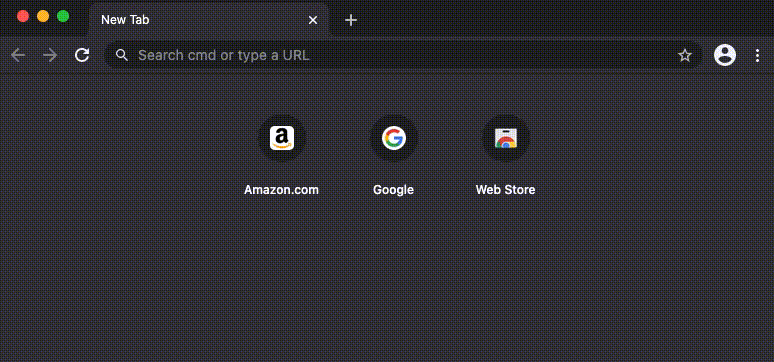
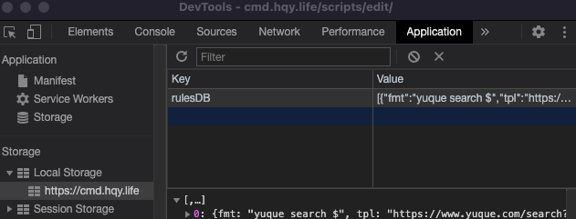

## Basic
A **rule** object is like this:
```json
{
  "fmt": "echo $",
  "tpl": "/scripts/echo?words=${0}",
  "inf": "display a line of text",
  "lnk": ["say $", "print $"]
}
```

`fmt` means the basic format of a command line, so `index.html` can match it with the typed in.

`tpl` is the template fot `index.html` to generate command line to url. As you know, the browser address bar does not accept a real command line, but a URL.

`inf` is the information about the command line, it helps to remember it's usage.

`lnk` is the alias to the same command line, they should have same parameters with `fmt`.

## Parameters
A command line support multiple parameters, you can use `_` and `$` to represent it.
While `_` only represent one word, and `$` represent rest of all.

For example:
```txt
rule format: tell _ $

tell Scott use my car.
  => _ = Scott
  => $ = use my car.
```
And they would pass into template by `${n}`(n start from 0):
```txt
rule template: sendmessageto?who=${0}&msg=${1}
  => sendmessageto?who=Scott&msg=use%20my%20car.
```

A full example:
```json
{
  "fmt": "trans _ _ $",
  "tpl": "https://translate.google.com/?sl=${0}&tl=${1}&text=${2}",
  "inf": "google translate",
  "lnk": ["gtrans _ _ $", "fanyi _ _ $"]
}
```
Use:
```txt
trans zh en 你好
trans en ja Hello, how are you.
```


## Database
The database of rules, is just a JSON string stored in `window.localStorage`. It's key is `"rulesDB"`. 



By `JSON.parse`, you can use it as an array. But don't forget use `JSON.stringify` before save it. 

Modern browser chrome can store max to `5MB` size for one data in `localStorage`, it's enough to save a lot of rules.