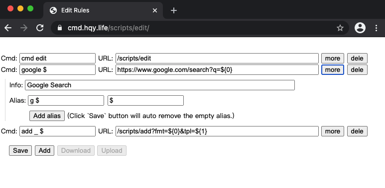

## Introduction 
This script is a web page/application that you can manage the [cmd.hqy.life](https://github.com/Cyang39/cmd.hqy.life) redirect rule database with a friendly user interface.

If there is no database in `localStorage`, this script will set an initial value.

## Usage
```txt
https://cmd.hqy.life/scripts/edit
```

No parameters required.

[Example](https://cmd.hqy.life/scripts/edit)

## Screenshot
